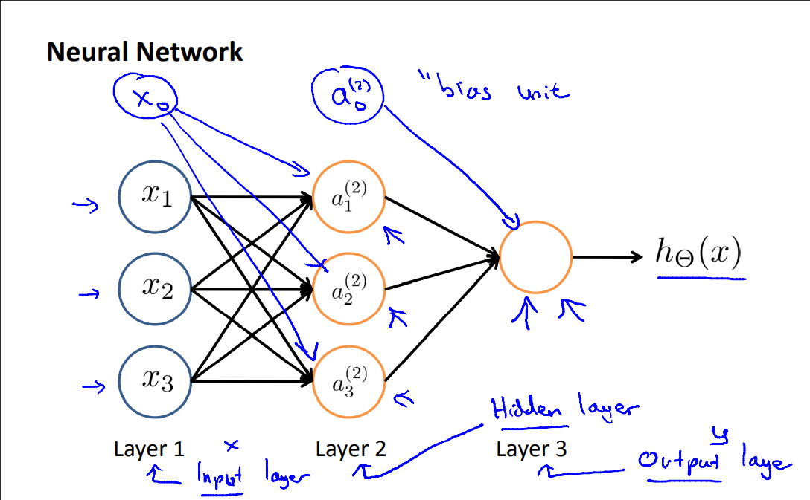
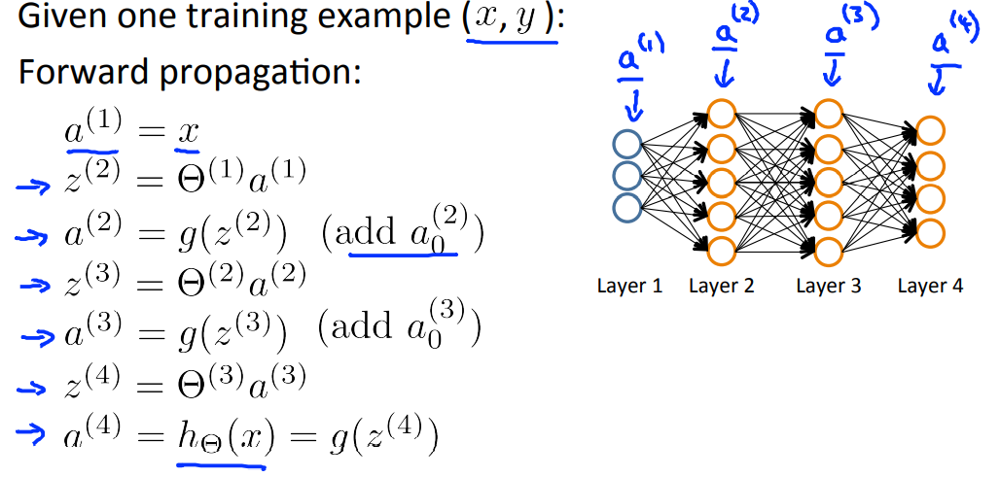
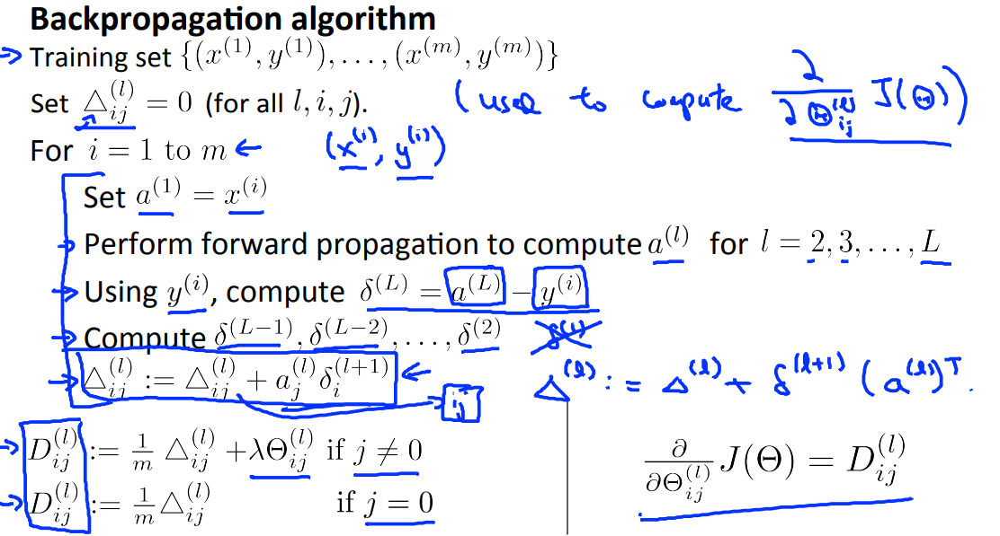
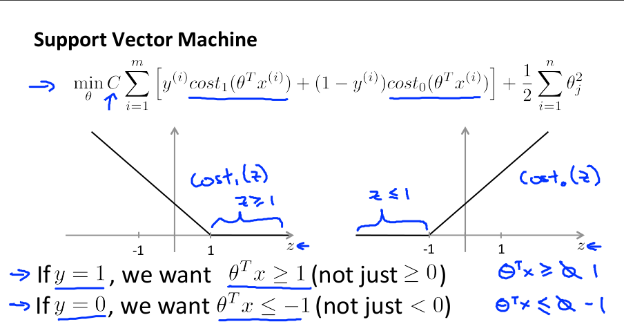
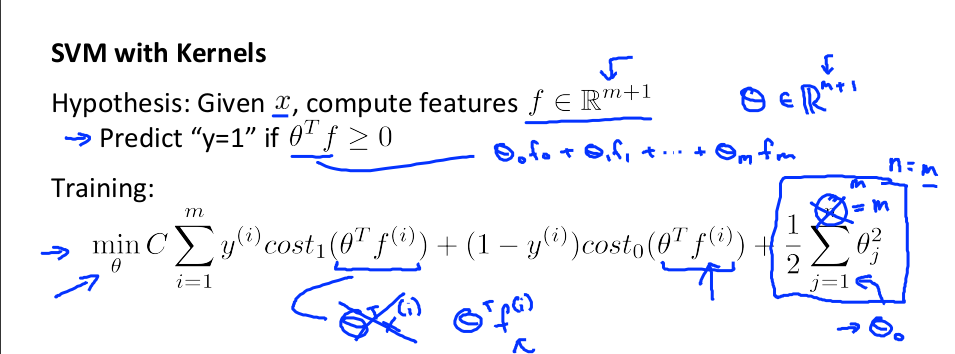
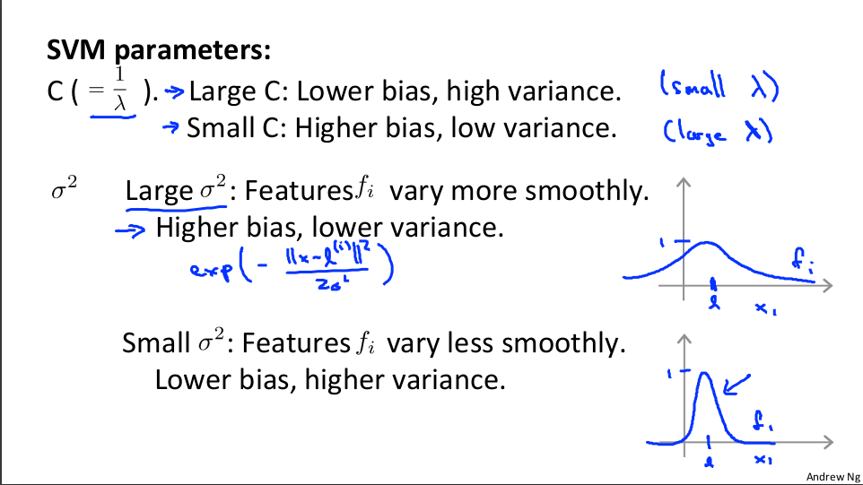
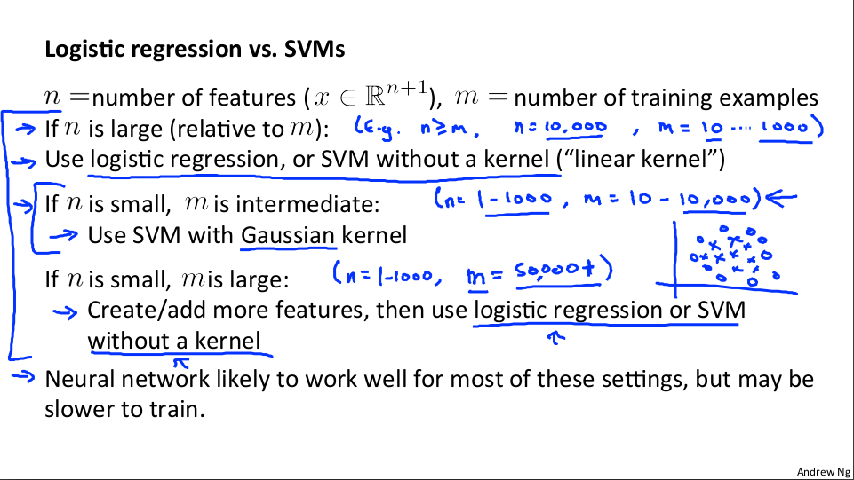
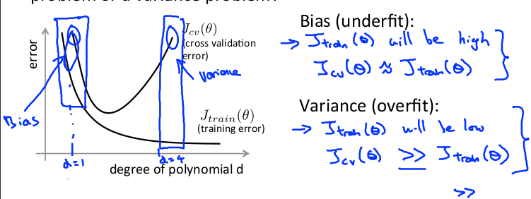
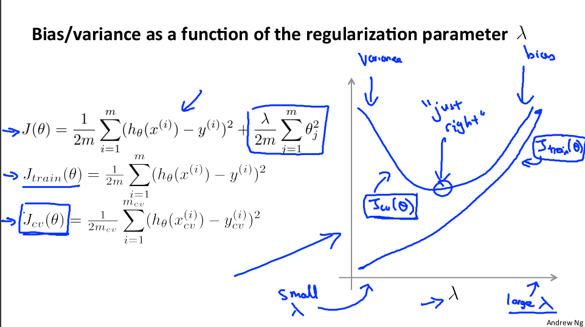

# **I. Các khái niệm ban đầu**
1. Khái niệm: Một chương trình máy tính được cho là học hỏi từ trải nghiệm E đối với một số loại nhiệm vụ T và thước đo hiệu suất P, nếu hiệu suất của nó ở các nhiệm vụ trong T, được đo bằng P, cải thiện theo trải nghiệm E
2. Nhiệm vụ T: Hồi quy, Phân loại
- Để phân biệt cần căn cứ vào dải giá trị đầu ra:
  - Nếu đầu ra vô hạn, liên tục => bài toán hồi quy
  - Nếu đầu ra hữu hạn, rời rạc => bài toán phân loại
3. Kinh nghiệm E: Giám sát, không giám sát
- Dựa trên kinh nghiệm trước đây đã có hay không có của đầu ra y tập dữ liệu
  - Học giám sát: có đầu ra y
  - Học không giám sát: không có đầu ra y
4. Đánh giá P: Từ việc tối ưu bài toán chúng ta đánh giá việc `học` của máy đã tốt chưa.
  - Học có giám sát: tối ưu hàm chi phí để tìm ra mô hình
  - Học không có giám sát: tối ưu để phân cụm dựa vào đặc trưng đầu vào
5. Lưu ý
  - Phân loại dựa vào y
  - Phân cụm dựa vào x

# **II. Các vấn đề kinh điển thuộc học có giám sát**
## 1. Các ký hiệu
- Số lượng mẫu huấn luyện : m
- Số lượng đặc trưng : n
- $(x^i, y^i)$: đầu vào, đầu ra của mẫu huấn luyện thứ i
- Bộ tham số : $\theta$

## 2. Bài toán hồi quy
- Hàm giả thuyết:  
  - $ h_\theta (x) = \theta^Tx = \theta_0 + \theta_1x_1 + \theta_2x_2 + ... + \theta_nx_n$
- Hàm chi phí: 
  - $ J(\theta) = \frac{1}{2m}\sum_{i=1}^m(h_\theta(x^i) - y_i)^2$
- Gradient descent: 
  - $ \theta_j := \theta_j - \alpha \frac{\partial}{\partial\theta_j}J(\theta)$

## 3. Bài toán phân loại
- Hàm giả thuyết:
  - $ h_\theta(x) = \frac{1}{1+ e^{-\theta^Tx}} $
- Dự đoán y = 1 nếu $h_\theta(x) \ge 0.5$ và y = 0 nếu $h_\theta(x) \le 0.5$
- Hàm chi phí: 
  - $J(\theta) = \frac{-1}{m} [\sum_{i=1}^m y^ilogh_\theta(x^i)+ (1-y^i)log(1-h_\theta(x^i))]$
- Gradient descent:
  - $ \theta_j := \theta_j - \alpha \frac{\partial}{\partial\theta_j}J(\theta) $
  - với $\frac{\partial}{\partial\theta_j}J(\theta) = \frac{1}{m}\sum_{i=1}^m(h_\theta(x^i)- y^i)x_j^i$

## 4. Bàn thêm vấn đề nâng cao
### 4.1. Những yếu tố cần quan tâm khi thực hiện Gradient descent
  - Hệ số học $\alpha$ : 
    - Nếu $\alpha$ quá nhỏ thì thuật toán có thể hội tụ chậm
    - Nếu $\alpha$ quá lớn thì thuật toán có thể không hội tụ
  - Số vòng lặp iter
  - Mỗi lần lặp cần phải cập nhật đồng thời hệ số $\theta$
  - Sử dụng phương pháp **`Feature Scaling`** để đảm bảo các đặc trưng có giá trị nằm trong 1 dải tương đồng từ đó có thể giảm thời gian tối thiểu hàm chi phí
### 4.2. Một số thuật toán khác dùng để tối ưu hàm chí
  - Conjugate gradient
  - Sử dụng công thức chuẩn: $\theta = (X^TX)^{-1}X^Ty$
  - BFGS
  - L-BFGS
### 4.3. Vấn đề overfitting
  - Một số khái niệm cần chú ý
    - bias: độ lệch giữa dự đoán và thực tế
    - variance: độ phân tán giá trị
  - Mong muốn: low bias và low variance
  - Hiện tượng: hàm giả thuyết quá vừa vặn trên tập huấn luyện nhưng lại có sai số lớn khi dự đoán một mẫu mới không thuộc tập huấn luyện
  - Hướng giải quyết:
    - Giảm số lượng đặc trưng, giữ lại những đặc trưng quan trọng, lựa chọn thuật toán khác
    - Sử dụng phương pháp Regularization để giữ lại tất cả các đặc trưng, giảm giá trị của tham số $\theta$
  #### 4.3.1 Regularization
  - Mục đích sử dụng:
    - Giảm giá trị của các tham số $\theta$
    - Đơn giản hóa hàm giả thuyết
    - Giảm hiện tượng overfitting
  - Bài toán hồi quy: 
    - Hàm chi phí: $J(\theta) = \frac{1}{2m}[\sum_{i=1}^m(h_\theta(x^i) - y_i)^2 + \lambda\sum_{j=1}^n \theta_j^2] $
    - Gradient descent: $ \theta_j := \theta_j(1 - \alpha \frac{\lambda}{m}) -\alpha\frac{1}{m}\sum_{i=1}^m(h_\theta(x^i)- y^i)x_j^i$
  - Bài toán phân loại
      - Hàm chi phí: $J(\theta) = -[\frac{1}{m}\sum_{i=1}^m (y^ilogh_\theta(x^i)+ (1-y^i)log(1-h_\theta(x^i))) + \frac{\lambda}{2m}\sum_{j=1}^n\theta_j^2] $
      - Gradient descent: $ \theta_j := \theta_j - \alpha[\frac{1}{m} \sum_{i = 1}^m(h_\theta(x^i)- y^i)x_j^i + \frac{\lambda}{m}\theta_j] $
  - Lưu ý:
    - $\lambda$ là hệ số regulazation
    - nếu $\lambda$ quá lớn sẽ gây hiện tượng underfitting
    - nếu $\lambda$ quá nhỏ sẽ gây hiện tượng overfitting

  #### 4.3.2 Non-linear hypotheses
  - Đây là vấn đề mở rộng của bài toán hồi quy tuyến tính với đặc tính đầu ra bám theo 1 đường tuyền tính => hồi quy phi tuyến với đặc tính đầu ra bám theo đường phi tuyến và bài toán hồi quy logistic (phân loại nhị phân) với đường phân chia tuyến tính => bài toán phân loại nhị phân với đường phân chia phi tuyến.
  - Tùy thuộc và dữ liệu mà chúng ta gặp trong một bài toán cụ thể, thay vì sử dụng những đặc trưng ban đầu thì đôi lúc định nghĩa những đặc trưng mới có thể giúp chúng ta có được một mô hình mới tốt hơn. Một ý tưởng liên quan mật thiết với ý tưởng này đó là hồi quy đa thức **`Polynomial regression`**.
  - Ví dụ khi dữ liệu bài toán không phân bố  theo một đường tuyến tính, việc sử dụng mô hình hồi quy phi tuyến sẽ cho kết quả đầu ra của mô hình tốt hơn khi sử dụng mô hình hồi quy tuyến tính.

# **III. Các vấn đề hiện đại thuộc học có giám sát**
## **1. Neural Network**
- Phương pháp hồi quy logistic hoạt động tốt khi số lượng đặc trưng nhỏ, còn trong thực tế một bài toán ML sẽ có rất nhiều đặc trưng. Để có thể có được một hàm giả thuyết phân chia các mẫu hợp lý thì cần sử dụng rất nhiều đặc trưng phi tuyến, sử dụng hàm đa thức bậc cao. Nếu sử dụng hết các đặc trưng phi tuyến hoặc bậc của đa thức quá cao sẽ dẫn đến hiện tượng overfitting và tốn  nhiều chi phí tính toán
- Neural network là một thuật toán đã được nghiên cứu từ lâu nhưng gần đây mới trở nên phổ biến bởi nó là một thuật toán cần chi phí tính toán lớn và chỉ có thể chạy tốt với những máy tính hiện đại ngày nay.

- Mô hình
  - Một mô hình sẽ bao gồm những phần sau:
    - Dữ liệu đầu vào: `input layer` => **x**
    - Lớp ẩn: `hidden layer`
    - Dữ liệu đầu ra: `output layer` => **y**
    

- Mục tiêu: tối ưu hàm chi phí để tìm ra mô hình tốt nhất
- Thuật toán lan truyền tiến: tìm ra hàm giả thuyết $h_\theta(x)$
  
- Thuật toán lan truyền ngược: tính ra $\frac{\partial}{\partial\theta_j}J(\theta)$ phục vụ cho `gradient descent`
  

- Các bước thực hiện khi huấn luyện một neural network:
  - khởi tạo ngẫu nhiên giá trị của trọng số $\theta$
  - sử dụng lan truyền tiến tìm ra hàm giả thuyết
  - tính toán hàm chi phí $J(\theta)$
  - sử dụng lan truyền ngược để tính $\frac{\partial}{\partial\theta_j}J(\theta)$
  - sử dụng gradient checking để kiểm tra $\frac{\partial}{\partial\theta_j}J(\theta)$
  - tắt gradient checking và sử dụng một thuật toán tối ưu để tối thiểu hàm chi phí.

## **2. Phương pháp SVM**
- Mục tiêu: giải quyết bài toán phân loại với đường bao phi tuyến
- Ưu điểm: hàm giả thuyết đơn giản hơn do mô hình xấp xỉ 2 đường thẳng => hàm chi phí đơn giản
- Bản chất: tìm đường phân chia sao cho margin lớn nhất
- Hàm chi phí: với $ C \approx \frac{1}{\lambda}$

- Các bước thực hiện
  - Biến đổi các đặc trưng ban đầu $x$ thành một đặc trưng mới $f$ thông qua các điểm `landmarks`: $l^{(1)}, l^{(2)},...., l^{(n)}$
  - Chọn $l^{(1)} = x^{(1)}; l^{(2)}= x^{(2)};....; l^{(n)}= x^{(n)}$
  - Lựa chọn `Kernels` để tìm $f$ 
  - Hàm chi phí sau biến đổi
    
  - Các tham số của SVM
    
- Lưu ý khi triển khai:
  - Cần chọn tham số $C$
  - Cần chọn `Kernels`: linear kernel, gaussian kernel, polynomial kernel,....
  - Cần chọn $\sigma^2$
- Lựa chọn thuật toán: Logistic regression vs Support Vector Machine
  
  

# **IV. Giải quyết các bài toán ML có giám sát**
## **1. Định hướng**
- Để xây dựng được một mô hình tốt, ta cần chia dữ liệu làm 3 phần: tập huấn luyện, tập kiểm thử và tập kiểm tra. Các dữ liệu trong 3 tập này cần được chọn lựa ngẫu nhiên và dữ liệu trong tập huấn luyện là nhiều nhất.
- Quy trình xây dựng như sau:
  - sử dụng dữ liệu trong tập train => tối thiểu hàm chi phí => lựa mô hình có giá trị hàm chi phí nhỏ nhất
  - sử dụng mô hình đã chọn trong tập train để đánh giá lỗi trên tập kiểm thử => lựa chọn mô hình có giá trị hàm chi phí nhỏ nhất
- Chuẩn đoán bias và variance
  - Khi hệ số bậc của mô hình nhỏ => $J(\theta)_{train}$ và $J(\theta)_{cv}$ đều lớn (underfit)
  - Khi hệ số bậc của mô hình tăng dần => $J(\theta)_{train}$ và $J(\theta)_{cv}$ đều giảm dần
  - Khi hệ số bậc lớn => $J(\theta)_{train}$ tiếp tục giảm còn $J(\theta)_{cv}$ tăng (overfit)
  
- Hệ số regularization và bias/variance
  - Khi $\lambda$ nhỏ, mô hình có khả năng bị overfit => $J(\theta)_{train}$ nhỏ, còn $J(\theta)_{cv}$ lớn
  - Khi $\lambda$ tăng dần => $J(\theta)_{train}$ tăng, còn $J(\theta)_{cv}$ giảm
  - Khi $\lambda$ lớn, mô hình có khả năng bị underfit => $J(\theta)_{train}$ và $J(\theta)_{cv}$ đều lớn
  
- Sau khi tìm được mô hình và thấy lỗi trên tập test vẫn lớn thì có một vài phương án xử lý như sau:
  - Lấy thêm nhiều dữ liệu => sửa lỗi high variance
  - Làm nhỏ tập dữ liệu => sửa lỗi high variance
  - Thêm đặc trưng => sửa lỗi high bias
  - Tăng bậc cho mô hình => sửa lỗi high bias
  - Giảm hệ số  $\lambda$ => sửa lỗi high bias
  - Tăng hệ số  $\lambda$ => sửa lỗi high variance
- Đối với Neural network
  - Mô hình đơn giản(ít layer ẩn, layer ít nút): chi phí tính toán rẻ nhưng dễ bị underfit
  - Mô hình phức tạp(nhiều layer ẩn, nhiều nút trong 1 layer): chi phí tính toán lớn, dễ bị over, có thể sử dung $\lambda$ để giảm overfit
## **2. Lưu ý khi thực hiện**
### **2.1 Các bước triển khai**
  - Bắt đầu với một thuật tóan đơn giản và có thể triển khai nhanh chóng
  - Vẽ đồ thị learning curves để quyết định hướng xử lý tiếp theo
  - Thực hiện việc phân tích lỗi: kiểm tra thủ công các trường hợp thuật toán mắc lỗi từ đó xác định được xu hướng lỗi và tập trung sửa lỗi theo xu hướng đó.
### **2.2 Phương pháp đánh giá các mô hình phân loại**
- Precision(P) và recall(R):
  - Precision được định nghĩa là tỉ lệ số điểm Positive mô hình dự đoán đúng trên tổng số điểm mô hình dự đoán là Positive. Recall được định nghĩa là tỉ lệ số điểm Positive mô hình dự đoán đúng trên tổng số điểm thật sự là Positive.
  

- $F_1$ Score: mong muốn càng cao càng tốt 
  - $F_1$ Score =  **$2\frac{PR}{P+R}$**
## **2.3 Vấn đề dữ liệu cho ML** 
  - Hiệu năng của các thuật toán thường tăng khi tăng số lượng dữ liệu
  - Sử dụng một thuật toán học với nhiều đặc trưng sẽ làm cho mô hình tránh underfit => $J(\theta)_{train}$ sẽ nhỏ
  - Sử dụng tập train có lượng dữ liệu lớn sẽ tránh được overfit => $J(\theta)_{train} \approx J(\theta)_{test}$

# **IV. Học không giám sát**

